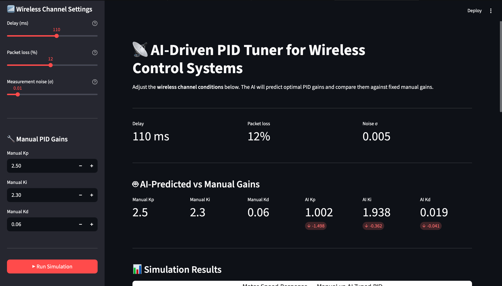
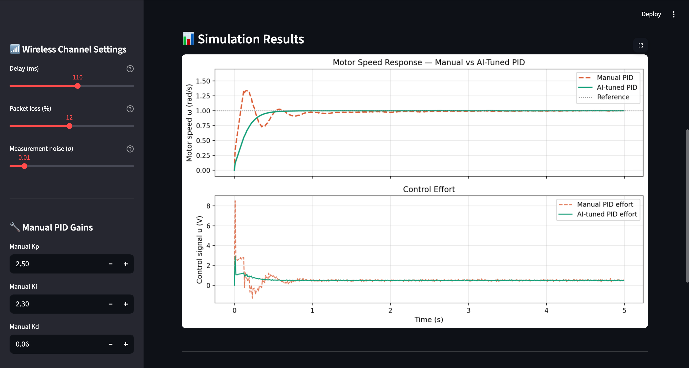
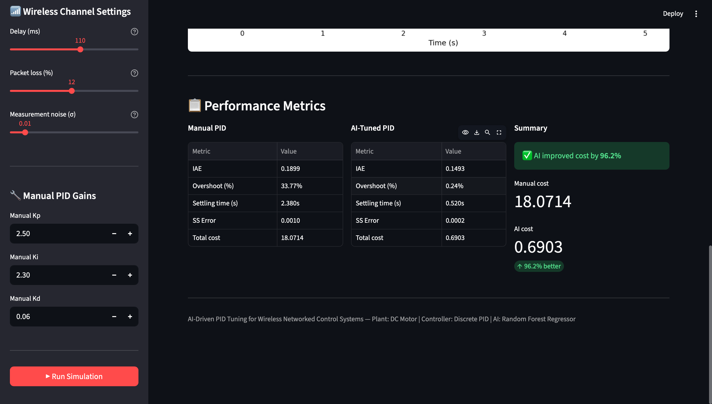
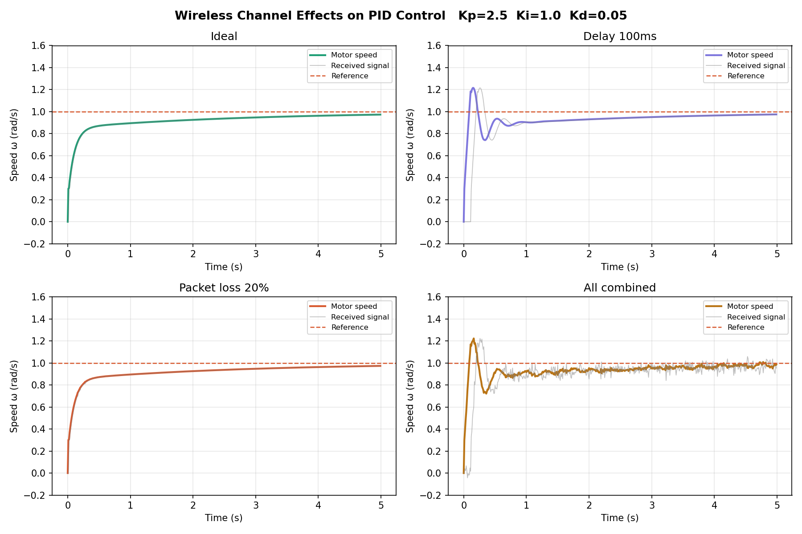
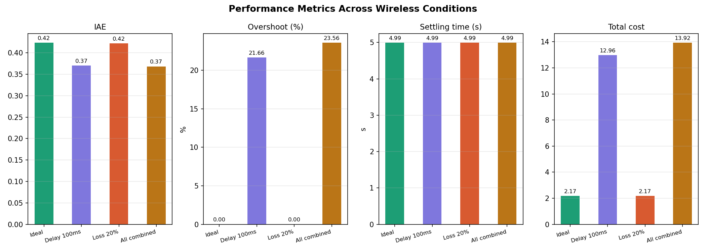
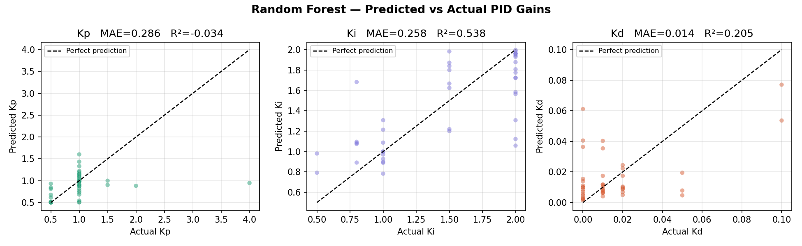
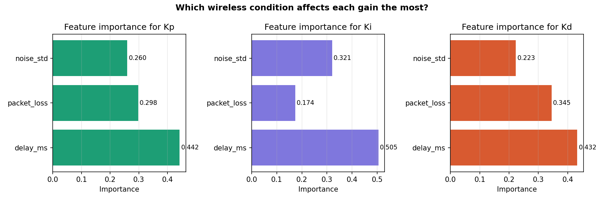

# 📡 AI-Driven PID Tuning for Wireless Networked Control Systems


> A simulation-based machine learning system that automatically predicts optimal PID gains for a DC motor control system operating over a degraded wireless communication channel.

---

## 🎯 Project Overview

In real-world control systems — drones, robots, industrial IoT, autonomous vehicles — the feedback signal travels over a **wireless network**, not a perfect wire. This introduces:

- **Delay** — sensor data arrives late (50–200ms)
- **Packet loss** — measurements are randomly dropped
- **Noise** — Gaussian corruption on sensor readings

These impairments break standard PID controllers: they cause **overshoot, oscillations, and instability**.

This project trains a **Random Forest AI model** to automatically predict optimal PID gains based on current wireless conditions — replacing manual re-tuning every time the channel changes.

---

## 📊 Results

### App Demo — 150ms Delay, 10% Packet Loss, σ=0.02 Noise



### Response Comparison — Manual PID vs AI-Tuned PID



| Metric | Manual PID | AI-Tuned PID | Improvement |
|---|---|---|---|
| IAE (tracking error) | 0.6191 | 0.2528 | **59% better** |
| Overshoot | 62.14% | 0.60% | **99% better** |
| Settling time | 4.99s | 1.65s | **3× faster** |
| Total cost score | 33.51 | 1.31 | **96% better** |

### Performance Metrics Dashboard



---

## 🏗️ System Architecture

```
Wireless Conditions
(delay · packet loss · noise)
          │
          ▼
    ┌─────────────┐         predicts        ┌─────────────────┐
    │   AI Model  │ ───────────────────────▶│  Kp · Ki · Kd   │
    │Random Forest│                         └────────┬────────┘
    └─────────────┘                                  │
                                                     ▼
Reference r ──────────────────────────────▶ ┌───────────────┐
                                             │ PID Controller│
                                             └───────┬───────┘
                                                     │ control signal u
                                                     ▼
                                             ┌───────────────┐
                                             │  DC Motor     │
                                             │  Plant        │
                                             └───────┬───────┘
                                                     │ motor speed ω
                                                     ▼
                                             ┌───────────────┐
                                             │    Sensor     │
                                             └───────┬───────┘
                                                     │
                                                     ▼
                                        ┌────────────────────────┐
                                        │   Wireless Channel     │
                                        │  delay · loss · noise  │
                                        └────────────┬───────────┘
                                                     │ degraded measurement
                                                     ▼
                                             back to PID controller
```

---

## 🧱 Project Structure

```
ai-wireless-pid-tuner/
│
├── data/
│   └── training_data.csv          ← 210 simulated scenarios
│
├── models/
│   ├── kp_model.pkl               ← trained Kp predictor
│   ├── ki_model.pkl               ← trained Ki predictor
│   └── kd_model.pkl               ← trained Kd predictor
│
├── src/
│   ├── plant.py                   ← DC motor physics (ODE)
│   ├── pid_controller.py          ← discrete PID with anti-windup
│   ├── wireless_channel.py        ← delay · packet loss · noise
│   ├── metrics.py                 ← IAE · overshoot · settling · cost
│   └── data_generator.py          ← simulation dataset builder
│
├── app/
│   ├── streamlit_app.py           ← Streamlit dashboard
│   └── gradio_app.py              ← Gradio dashboard (alternative)
│
├── results/
│   └── plots/                     ← all generated figures
│
├── main.py
├── requirements.txt
└── README.md
```

---

## ⚙️ How It Works

### 1. Plant — DC Motor (First-Order Model)

```
τ · dω/dt + ω = K · u
```

- `ω` = motor speed (rad/s)
- `u` = control voltage (V)
- `τ = 0.5s` = time constant
- `K = 2.0` = motor gain

### 2. PID Controller (Discrete)

```
e[k]  = r - y[k]
I[k]  = I[k-1] + e[k] · dt
D[k]  = (e[k] - e[k-1]) / dt
u[k]  = Kp·e[k] + Ki·I[k] + Kd·D[k]
```

Includes **anti-windup clamping** and **actuator saturation** limits.

### 3. Wireless Channel

| Effect | Implementation |
|---|---|
| Delay | FIFO queue buffer, releases after N steps |
| Packet loss | Random drop with probability p, hold-last strategy |
| Noise | Gaussian `N(0, σ²)` added to measurement |

### 4. Dataset Generation

For every combination of wireless conditions, 80 random PID gain combinations are tested. The one with the **lowest cost score** is saved as the training label.

```
Cost = 1.0·IAE + 0.5·Overshoot + 0.3·Settling_time + 0.1·Control_effort
```

**Dataset size:** 210 scenarios × 80 PID candidates = **16,800 simulations**

### 5. AI Model — Random Forest Regressor

- **Input:** `[delay_ms, packet_loss, noise_std]`
- **Output:** `[Kp, Ki, Kd]`
- 3 separate regressors (one per gain)
- 200 trees, trained on 168 samples, tested on 42

---

## 🚀 Quick Start

### 1. Clone and install

```bash
git clone https://github.com/YOUR_USERNAME/ai-wireless-pid-tuner.git
cd ai-wireless-pid-tuner
python -m venv venv
source venv/bin/activate      # Windows: venv\Scripts\activate
pip install -r requirements.txt
```

### 2. Generate training data

```bash
python src/data_generator.py
# Takes ~3 minutes — runs 16,800 simulations
```

### 3. Train the AI model

```bash
python src/train_model.py
# Takes ~10 seconds
```

### 4. Launch the dashboard

```bash
# Streamlit
streamlit run app/streamlit_app.py

# or Gradio
python app/gradio_app.py
```

Open `http://localhost:8501` in your browser.

---

## 📈 Generated Plots

### Wireless Channel Effects on PID Control



### Performance Metrics Across Wireless Conditions



### AI Model — Predicted vs Actual PID Gains



### Feature Importance — Which Wireless Factor Matters Most?



---

## 🧪 Individual Module Tests

Each source file can be run independently to verify it works:

```bash
python src/plant.py            # DC motor open-loop step response
python src/pid_controller.py   # PID closed-loop response
python src/wireless_channel.py # 4-panel wireless degradation comparison
python src/metrics.py          # Performance metrics bar charts
python src/data_generator.py   # Full dataset generation
python src/train_model.py      # Model training + evaluation plots
```

---

## 📦 Requirements

```
numpy
scipy
matplotlib
scikit-learn
streamlit
gradio
pandas
joblib
```

Install with:

```bash
pip install -r requirements.txt
```

---

## 🔬 Key Findings

- **Delay is the dominant factor** — 100ms delay alone increases cost by 6× vs ideal
- **Packet loss alone is manageable** — 20% loss with hold-last causes minimal degradation
- **AI dramatically reduces overshoot** — from 62% (manual) to 0.6% (AI) at 150ms delay
- **AI settles 3× faster** — 1.65s vs 4.99s under harsh wireless conditions
- **AI correctly learns to lower Kp under high delay** — the most critical adaptation

---

## 🔮 Future Work

- Add **jitter** (variable delay) to the wireless channel model
- Compare **Random Forest vs Neural Network** (MLPRegressor) performance
- Extend to **second-order plants** (mass-spring-damper, drone altitude)
- Add **online retuning** — model updates gains in real time as conditions change
- Deploy on a **Raspberry Pi** with actual wireless hardware

---

## 👤 Author

Built as a portfolio project demonstrating the intersection of:
- Control Systems Engineering
- Wireless Communications
- Machine Learning

**Stack:** Python · NumPy · SciPy · Scikit-learn · Streamlit · Gradio

---

## 📄 License

MIT License — free to use, modify, and distribute.